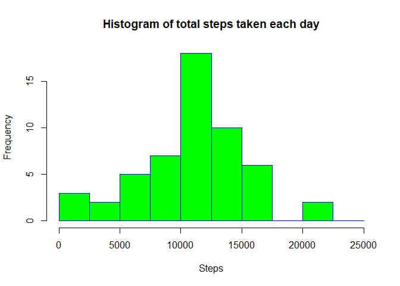
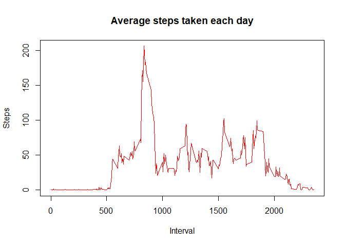
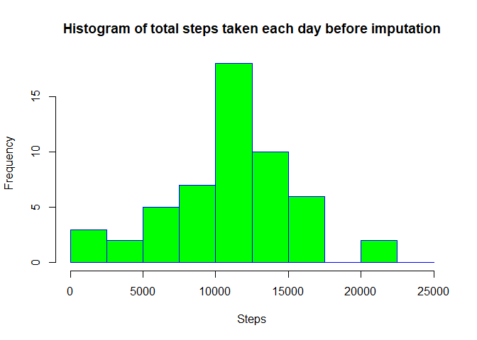
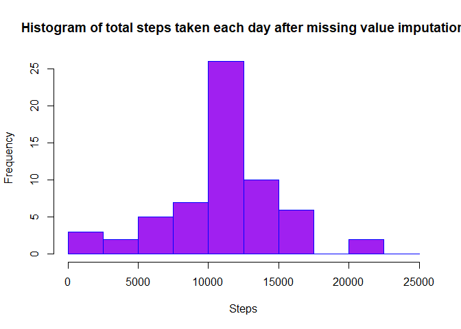
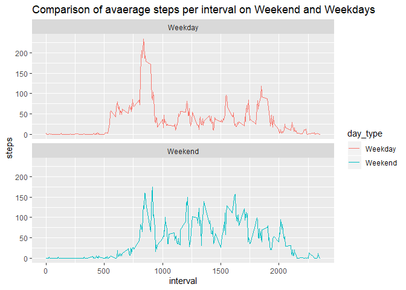

# Reproducible Research: Peer Assessment 1
download & unzip the required file

```r
url<-"https://d396qusza40orc.cloudfront.net/repdata%2Fdata%2Factivity.zip"
download.file(url,destfile = "./activity.zip")
unzip("activity.zip")
```

#  Loading and preprocessing the data
1.read the file

```r
a<-read.csv("activity.csv",stringsAsFactors = FALSE)
str(a)
```

```
## 'data.frame':	17568 obs. of  3 variables:
##  $ steps   : int  NA NA NA NA NA NA NA NA NA NA ...
##  $ date    : chr  "2012-10-01" "2012-10-01" "2012-10-01" "2012-10-01" ...
##  $ interval: int  0 5 10 15 20 25 30 35 40 45 ...
```

```r
head(a)
```

```
##   steps       date interval
## 1    NA 2012-10-01        0
## 2    NA 2012-10-01        5
## 3    NA 2012-10-01       10
## 4    NA 2012-10-01       15
## 5    NA 2012-10-01       20
## 6    NA 2012-10-01       25
```

2.transform the character date to standard date format

```r
a$date<-as.Date(a$date,"%Y-%m-%d")
str(a)
```

```
## 'data.frame':	17568 obs. of  3 variables:
##  $ steps   : int  NA NA NA NA NA NA NA NA NA NA ...
##  $ date    : Date, format: "2012-10-01" "2012-10-01" ...
##  $ interval: int  0 5 10 15 20 25 30 35 40 45 ...
```

# What is mean total number of steps taken per day?

1.Calculate the total number of steps taken per day

```r
b<-aggregate(a$steps~a$date,FUN=sum,na.rm=TRUE)
head(b)
```

```
##       a$date a$steps
## 1 2012-10-02     126
## 2 2012-10-03   11352
## 3 2012-10-04   12116
## 4 2012-10-05   13294
## 5 2012-10-06   15420
## 6 2012-10-07   11015
```
2.Make a histogram of the total number of steps taken each day

```r
hist(b[,2],xlab="No. of steps each day",main=" histogram of the total number of steps taken each day")  
```

 

3.Calculate and report the mean and median of the total number of steps taken per day

```r
summary(b)
```

```
##      a$date              a$steps     
##  Min.   :2012-10-02   Min.   :   41  
##  1st Qu.:2012-10-16   1st Qu.: 8841  
##  Median :2012-10-29   Median :10765  
##  Mean   :2012-10-30   Mean   :10766  
##  3rd Qu.:2012-11-16   3rd Qu.:13294  
##  Max.   :2012-11-29   Max.   :21194
```

#What is the average daily activity pattern?

1.calculating mean steps per interval

```r
c<-with(a,aggregate(steps~interval,FUN=mean,na.rm=TRUE))
c$steps<-as.integer(c$steps)
str(c)
```

```
## 'data.frame':	288 obs. of  2 variables:
##  $ interval: int  0 5 10 15 20 25 30 35 40 45 ...
##  $ steps   : int  1 0 0 0 0 2 0 0 0 1 ...
```

```r
head(c)
```

```
##   interval steps
## 1        0     1
## 2        5     0
## 3       10     0
## 4       15     0
## 5       20     0
## 6       25     2
```
2.Make a time series plot (i.e. type = "l") of the 5-minute interval (x-axis) and the average number of steps taken, averaged across all days (y-axis)

```r
with(c,plot(steps~sort(interval),type="l",xlab="interval",ylab="average steps"))  
```

 

3.Which 5-minute interval, on average across all the days in the dataset, contains the maximum number of steps?

```r
c[which.max(c$steps),]
```

```
##     interval steps
## 104      835   206
```

#Imputing missing values

1.Calculate and report the total number of missing values in the dataset (i.e. the total number of rows with NAs)

```r
summary(a)
```

```
##      steps             date               interval     
##  Min.   :  0.00   Min.   :2012-10-01   Min.   :   0.0  
##  1st Qu.:  0.00   1st Qu.:2012-10-16   1st Qu.: 588.8  
##  Median :  0.00   Median :2012-10-31   Median :1177.5  
##  Mean   : 37.38   Mean   :2012-10-31   Mean   :1177.5  
##  3rd Qu.: 12.00   3rd Qu.:2012-11-15   3rd Qu.:1766.2  
##  Max.   :806.00   Max.   :2012-11-30   Max.   :2355.0  
##  NA's   :2304
```
From the above summary we see that there are only 2304 missing values (NAs) in the step column  

2.Devise a strategy for filling in all of the missing values in the dataset. The strategy does not need to be sophisticated. For example, you could use the mean/median for that day, or the mean for that 5-minute interval, etc.
Using the mean of the steps in each interval from dataset "c" to impute NA since interval means will represent the steps missing values from those itervals better  

3.Create a new dataset that is equal to the original dataset but with the missing data filled in.

```r
d<-a
for (i in 1:nrow(d))
if (is.na(d[i,1]))
    d[i,1]<-c[which(c[,1]==d[i,3]),2]
summary(d)
```

```
##      steps             date               interval     
##  Min.   :  0.00   Min.   :2012-10-01   Min.   :   0.0  
##  1st Qu.:  0.00   1st Qu.:2012-10-16   1st Qu.: 588.8  
##  Median :  0.00   Median :2012-10-31   Median :1177.5  
##  Mean   : 37.33   Mean   :2012-10-31   Mean   :1177.5  
##  3rd Qu.: 27.00   3rd Qu.:2012-11-15   3rd Qu.:1766.2  
##  Max.   :806.00   Max.   :2012-11-30   Max.   :2355.0
```

Again finding total steps each day

```r
db<-aggregate(d$steps~d$date,FUN=sum,na.rm=TRUE)
```
4.Make a histogram of the total number of steps taken each day and Calculate and report the mean and median total number of steps taken per day. Do these values differ from the estimates from the first part of the assignment? What is the impact of imputing missing data on the estimates of the total daily number of steps?

```r
hist(b[,2],xlab="No. of steps each day",
     main=" before imputation
     histogram of the total number of steps taken each day")
```

 

```r
hist(db[,2],xlab="No. of steps each day",
     main=" after imputation
     histogram of the total number of steps taken each day")
```

 

```r
summary(b)
```

```
##      a$date              a$steps     
##  Min.   :2012-10-02   Min.   :   41  
##  1st Qu.:2012-10-16   1st Qu.: 8841  
##  Median :2012-10-29   Median :10765  
##  Mean   :2012-10-30   Mean   :10766  
##  3rd Qu.:2012-11-16   3rd Qu.:13294  
##  Max.   :2012-11-29   Max.   :21194
```

```r
summary(db)
```

```
##      d$date              d$steps     
##  Min.   :2012-10-01   Min.   :   41  
##  1st Qu.:2012-10-16   1st Qu.: 9819  
##  Median :2012-10-31   Median :10641  
##  Mean   :2012-10-31   Mean   :10750  
##  3rd Qu.:2012-11-15   3rd Qu.:12811  
##  Max.   :2012-11-30   Max.   :21194
```
Comparing the above summaries of before and after imputation  
The mean of steps has decreased from 10766 earlier to 10750  
Even the quantile values of steps has changed  
Impact: the impact of imputing data is that the mean of the total daily steps has decreased

#Are there differences in activity patterns between weekdays and weekends?

1.Create a new factor variable in the dataset with two levels - "weekday" and "weekend" indicating whether a given date is a weekday or weekend day

```r
e<-d
e$weekday<-weekdays(d$date)
e$d_weekend<-0
for (i in 1:nrow(e))
if(e[i,4]=="Saturday"|e[i,4]=="Sunday") {e[i,5]<-1} else {e[i,5]<-0}
eb<-with(e,aggregate(steps~interval+d_weekend,FUN=mean))
eb<-transform(eb,d_weekend=factor(d_weekend,labels=c("weekday","weekend")))
```
2.Make a panel plot containing a time series plot (i.e. type = "l") of the 5-minute interval (x-axis) and the average number of steps taken, averaged across all weekday days or weekend days (y-axis). See the README file in the GitHub repository to see an example of what this plot should look like using simulated data

```r
library(lattice)
xyplot(steps~interval|d_weekend,data=eb,layout=c(1,2),type="l",ylab="Average no. of Steps per interval")  
```

 
  
  From the above graphs we can clearly see that there is a lot of difference in the average steps on weekends and weekdays  
Over weekends on an average the number of steps are more compared to weekdays  
